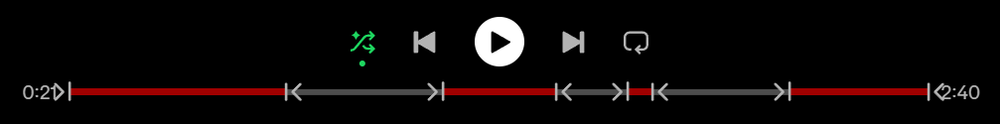
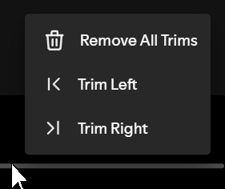
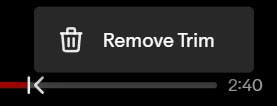

# Track Trim

Track trim is an extension that allows you to trim the unwanted sections of your songs. This is useful for those annoying skits or long sections of instrumental at the ends of a song.

## Installation

### Marketplace (easy):

The easiest way to install this extension is through the marketplace. Simply search for "Track Trim" and click the install button. You may need to click the "Load more" button to find the extension.

### Manually:

- Download the latest release here: [Download](https://github.com/BenWithJamInn/spotify-track-trim/releases/latest/download/track-trim.js)
- Open command prompt and enter the following command `spicetify config-dir` to open your spicetify config folder
- Copy and paste the file you downloaded earlier into the `Extensions` folder
- Finally run the commands `spicetify config extensions track-trim.js` and `spicetify apply`

## How to use

### Adding a Trim

- Right click anywhere on the playbar to open the context menu
- Select trim right or trim left
- You can then edit the trim by dragging the start and end icons on the playbar

### Removing a Trim

- To remove an individual trim right click either the start or end icon and select "Remove Trim"
- To remove all trims from a song right click anywhere on the playbar and select "Remove All Trims"

### Import and Export Trims

- Select your profile icon in the top right
- Open the "Track Trim" submenu
- Select either import or export

Note: When importing <ins>all</ins> trims will be deleted and overwritten with the imported trims.

## Made with Spicetify Creator
- https://github.com/spicetify/spicetify-creator
